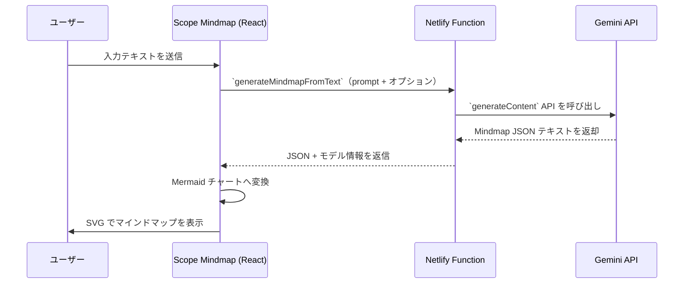

# Scope Mindmap アーキテクチャ概要

Scope Mindmap は「テキスト入力 → Gemini で構造化 → Mermaid で可視化」をワンストップで提供する単機能アプリです。React 18 + Vite + TypeScript をベースに、Netlify Functions 経由で Gemini API を呼び出します。Firestore や認証は完全に排除されており、ユーザーの入力テキストと生成結果はすべてクライアントメモリ内で完結します。

## 技術スタック

- フロントエンド: React 18, TypeScript 5, Vite, Tailwind 利用可能（デザインは主にインラインスタイル）
- 共有ライブラリ: `packages/shared`（Mermaid 表示コンポーネントと Gemini プロキシユーティリティを提供）
- バックエンド: なし（Netlify Functions 上の Gemini プロキシのみ）
- デプロイ: Netlify（`netlify/functions/gemini-proxy.js` が Google AI Studio の API キーを仲介）
- AI モデル: Gemini 2.5 Flash を既定に、`VITE_GEMINI_MODEL_OVERRIDE` で上書き可能

## ディレクトリ構成（抜粋）

```
scope-monorepo/
├── web-app/                     # Scope Mindmap の SPA 本体
│   ├── src/
│   │   ├── App.tsx              # React Router のルート定義（`/` のみ）
│   │   ├── main.tsx             # Vite エントリーポイント
│   │   └── pages/
│   │       └── MindmapPage.tsx  # 入力フォームと Mindmap 表示を担う画面
│   └── package.json
├── packages/
│   └── shared/
│       ├── src/
│       │   ├── components/
│       │   │   └── MindmapDisplay.tsx  # Mermaid レンダリング専用コンポーネント
│       │   └── utils/
│       │       ├── geminiProxy.ts      # Netlify Functions を叩く fetch ラッパー
│       │       └── mindmap.ts          # Gemini 応答 JSON → Mermaid 変換ロジック
│       └── package.json
├── netlify/
│   └── functions/
│       └── gemini-proxy.js       # Google Generative Language API へのフォワーダー
└── docs/ai/                      # 本ドキュメント群
```

## 画面とルーティング

- `/`: `MindmapPage.tsx`
  - テキストエリアと生成ボタン、ローディング表示、エラー表示
  - 生成結果は `MindmapDisplay` に渡され、Mermaid 描画が行われる
  - 認証や Firestore 連携は存在しない
- 404 含むその他のパスも `MindmapPage` にフォールバックする簡易ルーティング構成

## データフロー



## 主要モジュール

- `web-app/src/pages/MindmapPage.tsx`
  - ユーザー入力状態（`inputText`）、生成結果（`chart`）、ローディングとエラー状態を保持
  - `generateMindmapFromText` を呼び出して Mermaid 文字列を取得
  - 結果を `MindmapDisplay` へ渡し SVG を描画
- `packages/shared/src/utils/mindmap.ts`
  - Gemini プロンプトの生成と応答 JSON の検証を行う
  - `MindmapSchema`（rootTopic, categories, emotions, actions）を Mermaid の `graph LR` 記法に変換
  - 変換結果と呼び出しに利用したモデル情報を返却
- `packages/shared/src/components/MindmapDisplay.tsx`
  - Mermaid のインスタンスを初期化し、SVG に変換して DOM へ埋め込む
  - 変換失敗時はエラーメッセージを描画
- `netlify/functions/gemini-proxy.js`
  - ブラウザから API キーを隠蔽し、モデル切り替えやリトライ制御を担う
  - 429/503 などの応答をハンドリングしてリトライ、成功時はテキストのみ抽出する

## 環境変数

| 名前 | 説明 | スコープ |
| --- | --- | --- |
| `GEMINI_API_KEY` | Netlify Functions で使用する Google AI Studio のキー | サーバー (Netlify) |
| `VITE_GEMINI_MODEL_OVERRIDE` | カンマ区切りで指定したモデルを優先的に利用 | ブラウザ & Functions |
| `VITE_GEMINI_PROXY_ENDPOINT` | プロキシ URL を上書きしたい場合に指定 | ブラウザ |

その他の Firebase 関連環境変数や設定ファイルは削除済みです。

## 開発フローのポイント

1. `yarn install`
2. `yarn dev -w web-app` で開発サーバーを起動
3. 入力テキストを用意し、マインドマップが生成されることを確認
4. 依存する共有ロジックを変更した場合は `yarn build -w packages/shared` で型エラーを検出

テキストを外部に送信する前提のため、機密情報が含まれないよう注意してください。
