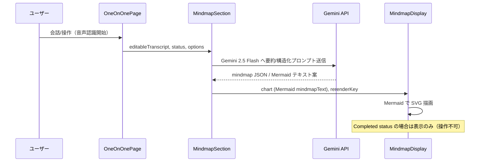

機能仕様 MindmapDisplay と周辺機能（2025年版）
1. 概要
本ドキュメントは、Mermaid 形式の mindmap を描画する共通 UI コンポーネント `MindmapDisplay` と、その親コンポーネント `MindmapSection` の振る舞い／データフローを整理したもの。OneOnOnePage で実行される 1on1 セッション中に、音声認識結果から AI（Gemini 系モデル）を活用して mindmap を生成・可視化する仕組みを扱う。

役割整理
- MindmapDisplay: Mermaid mindmap テキストを受け取り、SVG に描画する表示専用コンポーネント。
- MindmapSection: 音声認識ログ（transcript）を管理し、Gemini API を呼び出して mindmapText を生成する父コンポーネント。生成後は MindmapDisplay へ chart prop として受け渡す。
- OneOnOnePage: Active モードでは MindmapSection を編集可能として組み込み、Completed モードでは読み取り専用として表示する。

2. 関連コンポーネントツリーとデータフロー
```
OneOnOnePage.tsx (祖父)
└─ MindmapSection.tsx (親)
   └─ MindmapDisplay.tsx (子)
```

データフロー概略


3. MindmapDisplay コンポーネント仕様
Props
| Prop | 型 | 必須 | 説明 |
| --- | --- | --- | --- |
| `chart` | string | 必須 | Mermaid mindmap 構文。 |
| `rerenderKey` | number | 任意 | Mermaid レンダリングを強制再実行するためのキー。 |

機能詳細
- `mermaid` ライブラリ（v10 系）を利用し、`chart` を SVG に変換して描画。
- `chart` の変更時に再描画を実施。`rerenderKey` が増分された場合も再描画を行う。
- Mermaid の構文エラー発生時は catch して警告メッセージを表示し、既存描画を保持する。
- Tailwind CSS を用いたレイアウト調整を許容（背景色、枠線などは親から受け取ることを前提）。

4. MindmapSection の役割
MindmapDisplay を活用するため、以下の業務ロジックを担当する。

- 音声認識データ管理: `react-speech-recognition` から取得した transcript を `editableTranscript` にバインド。
- Gemini API 呼び出し: `@google/generative-ai` を通じて Gemini 2.5 Flash（フォールバックとして 1.5 Flash）を優先利用。モデルは `VITE_GEMINI_MODEL_OVERRIDE` でカスタマイズ可能。
- プロンプト戦略: 会話内容から「テーマ」「事実・トピック」「感情・価値観」「次のアクション」を抽出する JSON を生成 → Mermaid mindmapText へ変換。
- 更新ロジック: 3 秒デバウンスで transcript 変更を検知し自動更新。ユーザーが「マインドマップ更新」ボタンを押した場合は即時更新。
- モーダル制御: MindmapDisplay の拡大表示（`MindmapModal`）を管理。
- 状態管理: `isGeneratingMap`, `isAutoUpdating` などを UI に反映。

Completed モードの制御
- OneOnOnePage から `status` を受け取り、`status === "completed"` の場合は以下を実施。
  - 音声認識の開始・停止ボタン、AI 再生成ボタンを非表示。
  - Firestore への更新イベントをクライアント側でも抑止（サーバールールと二重防御）。
  - MindmapDisplay は最新の mindmapText を表示するが、編集系操作は提供しない。

5. 関連データモデル（`packages/shared/src/types/index.ts` 抜粋）
```ts
export interface OneOnOneDoc {
  id: string;
  managerId: string;
  managerName: string;
  memberId: string;
  memberName: string;
  createdAt: Timestamp;
  sessionId?: string;
  status?: "active" | "completed";
  mindmapText?: string;
  mindmap?: { nodes: unknown[]; links: unknown[] };
  transcript?: string;
  summaryPoints?: string;
  summaryNextActions?: string;
  reflection?: string;
  positiveMemo?: string;
}
```

Firestore 側では `status` により更新可否が決まる。`status === "completed"` の場合は Security Rules で update/delete を拒否する。

6. 処理フロー詳細
1. OneOnOnePage が Firestore からセッションを購読し、`status` を判定。
2. Active の場合、MindmapSection が transcript を監視し、Gemini へリクエスト → mindmapText を生成。
3. mindmapText を `MindmapDisplay` に渡し、Mermaid で可視化。マインドマップ更新時は `setDoc`（merge）で Firestore に保存。
4. Completed の場合、MindmapSection は描画のみ。更新系 UI は非表示となり、Firestore ルールにもより更新は拒否される。

コードスニペット（省略版）
```tsx
// packages/shared/src/components/MindmapSection.tsx
const MODEL_CANDIDATES = import.meta.env.VITE_GEMINI_MODEL_OVERRIDE?.split(",") ?? [
  "gemini-2.5-flash",
  "gemini-1.5-flash-latest",
  "gemini-1.5-flash",
];

export function MindmapSection(props: MindmapSectionProps) {
  const { editableTranscript, status, initialMindmapText, onMindmapUpdate } = props;
  const [mindmapText, setMindmapText] = useState(initialMindmapText ?? "");
  const [isGeneratingMap, setIsGeneratingMap] = useState(false);

  const generateMindmap = useCallback(async () => {
    if (status === "completed") return;
    // Gemini 呼び出し → mindmapText 更新処理（略）
  }, [editableTranscript, status]);

  useEffect(() => {
    const timer = setTimeout(() => {
      if (status === "active") {
        void generateMindmap();
      }
    }, 3000);
    return () => clearTimeout(timer);
  }, [editableTranscript, status, generateMindmap]);

  return (
    <Section title="マインドマップ">
      <MindmapDisplay chart={mindmapText} rerenderKey={mindmapText.length} />
      {status === "active" && <UpdateButton onClick={generateMindmap} disabled={isGeneratingMap} />}
    </Section>
  );
}
```

> TODO: モデルごとのトークンコストとレスポンス SLA を整理し、ビジネス要件に応じたスロットリング戦略を検討する。
